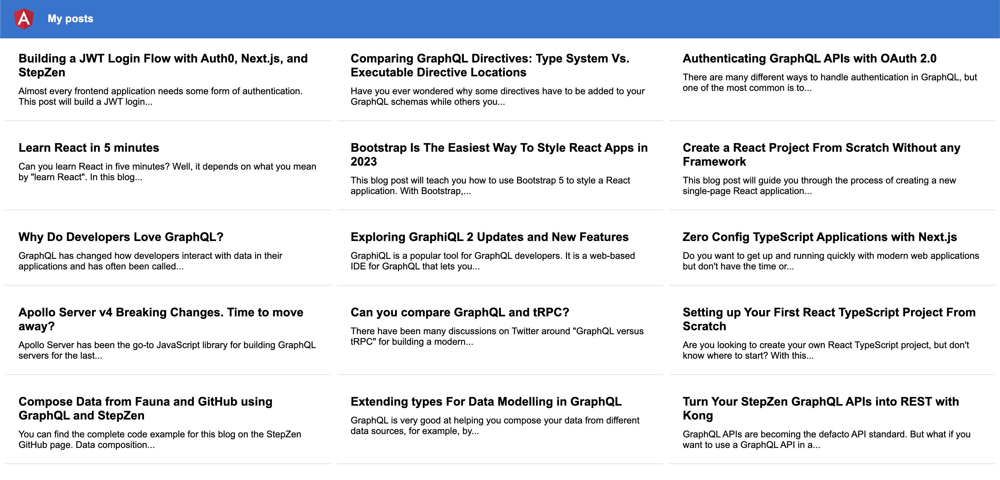

# StepZen Example: `with-angular`

## Introduction

This project builds an Angular app that fetches data from a GraphQL API using Apollo Client.



## Getting Started

You'll need to create a [StepZen account](https://stepzen.com/signup) first.

Once you've got that set up, [git clone](https://www.atlassian.com/git/tutorials/setting-up-a-repository/git-clone) this repository onto your machine and open the working directory:

```bash
git clone https://github.com/stepzen-dev/examples.git
cd examples/with-angular
```

## Run StepZen

Open your terminal and [install the StepZen CLI](https://stepzen.com/docs/quick-start). You need to login here using the command: `stepzen login`.

Start the StepZen GraphQL API by running the following command:

```bash
cd stepzen
stepzen start
```

This command will deploy the schemas to StepZen and print the endpoint at which your GraphQL API is deployed in the terminal. You can query your GraphQL API from any application, browser, or IDE by providing the API Key linked to your account.

> The StepZen GraphQL API is deployed as a public API. You can change this and protect it with your StepZen API Key by deleting the `config.yml` file in the `stepzen` directory.

You can add the endpoint that's printed in the terminal to the `app/graphql.module.ts` file in the Angular app on line 6:

```ts
const uri = ''; // <-- add the URL of the GraphQL server here
```

And then continue the setup of the Angular app.

## Run Angular

Open a new terminal and run the following commands:

```bash
npm install
```

This will install all the dependencies for the Angular app. After that, run the following command to start the Angular app:

```bash
npm start
```

This will start the Angular app on `localhost:4200`. You can now open the app in your browser and see the data from the GraphQL API.

## Learn More

You can learn more in the [StepZen documentation](https://stepzen.com/docs). Questions? Head over to [Discord](https://discord.gg/9k2VdPn2FR) or [GitHub Discussions](https://github.com/stepzen-dev/examples/discussions) to ask questions.
