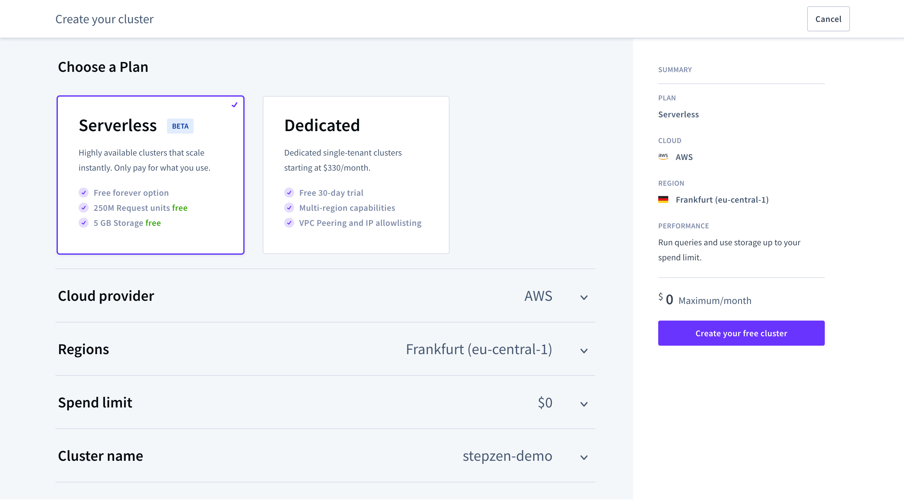
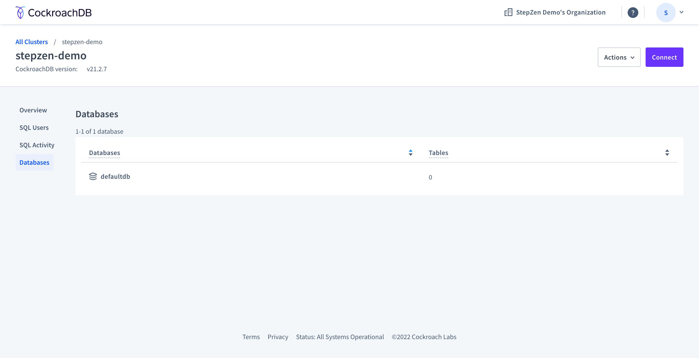
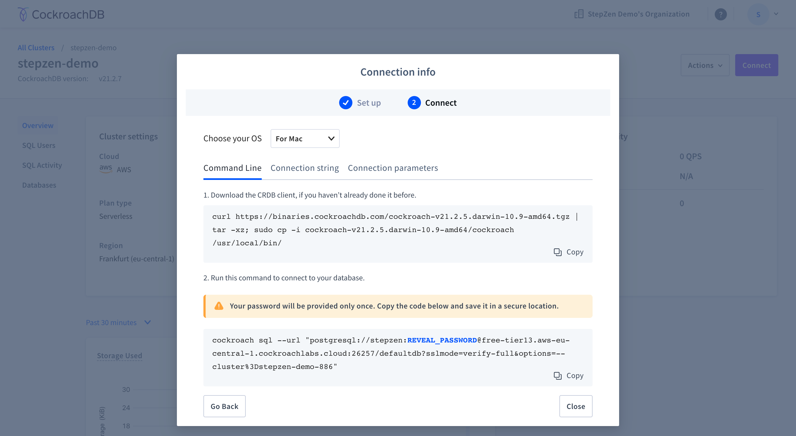
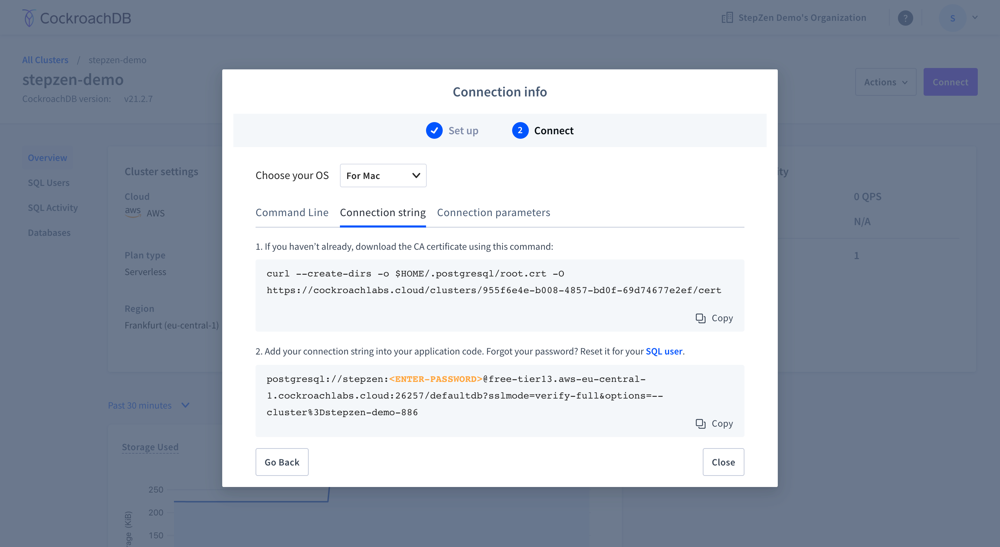

# StepZen Example: `with-cockroachdb`

## Introduction

This project builds a GraphQL API connected to CockroachDB using StepZen. [CockroachDB](https://www.cockroachlabs.com/get-started-cockroachdb/) is a cloud-native database with PostgreSQL compatibility.

## Getting Started

You'll need to create a [StepZen account](https://stepzen.com/request-invite) first. Once you've got that set up, [git clone](https://www.atlassian.com/git/tutorials/setting-up-a-repository/git-clone) this repository onto your machine and open the working directory:

```bash
git clone https://github.com/stepzen-dev/examples.git
cd examples/with-cockroachdb
```

Before you can run this example, you need to have a CockroachDB cluster. Which you can set up in the next section.

## Set up CockroachDB

CockroachDB can be set up in the cloud or self-hosted. In this example, we'll use a serverless cloud version that you can set up in a few steps. First, you need to create an account, after which you can create and populate a new CockroachDB cluster.

### Create an account and cluster

1. Create an account on [CockroachDB](https://cockroachlabs.cloud/signup)

2. Create a new CockroachDB cluster. You need to select what cloud provider you want your cluster to be deployed on and in which region.



3. After pressing "create" a new cluster with a database will be created.



4. Get the connection details for CockroachDB by pressing "Connect". Here you'll find multiple ways to connect with CockroachDB. You can get the commands to connect with CockroachDB over the command line, the connection string (`dsn`), or the connection credentials themselves.



5. Connect to your CockroachDB database cluster from your command line, by executing the following commands that you can copy-paste from the previous step:

   - Download the CRDB client if you haven’t already done it before.

   `curl https://binaries.cockroachdb.com/cockroach-v21.2.5.darwin-10.9-amd64.tgz | tar -xz; sudo cp -i cockroach-v21.2.5.darwin-10.9-amd64/cockroach /usr/local/bin/`

   - Run this command to connect to your database. Copy-paste the command from the CockroachDB dashboard, and it will look something like the following:

   `cockroach sql --url "postgresql://<COCKROACHDB_USERNAME>:<COCKROACHDB_PASSWORD>@<COCKROACHDB_HOST>:26257/defaultdb?sslmode=verify-full&options=--cluster%3D<DATABASE_NAME>"`

6. The CockroachDB CLI will respond with the following message. In the next section, you can use this console to populate the CockroachDB database.

```bash
#
# Welcome to the CockroachDB SQL shell.
# All statements must be terminated by a semicolon.
# To exit, type: \q.
#
```

Your CockroachDB cluster is now available on the cloud provider you previously selected.

### Populate with data

1. Open the console of the CockroachDB CLI, as shown in the last step of the previous section. In this console, you need to copy-paste the contents on the file `init.sql` from this repository.

```sql
CREATE TABLE "customer" (
    email character(50) NOT NULL,
    id integer NOT NULL,
    name character(50) NOT NULL
);

CREATE TABLE "order" (
    id integer NOT NULL,
    createdat date NOT NULL,
    shippingcost double precision,
    customerid integer NOT NULL,
    carrier character(20),
    trackingid character(30)
);

INSERT INTO
    customer (email, id, name)
VALUES
    ('lucas.bill@example.com', 1, 'Lucas Bill'),
    /* other */

INSERT INTO
    "order" (
        id,
        createdat,
        shippingcost,
        customerid,
        carrier,
        trackingid
    )
VALUES
    (1, '2020-08-05', 3, 4, NULL, NULL),
    /* other */
```

2. You'll get a response from the CockroachDB CLI stating if your commands were successful:

```bash
CREATE TABLE

Time: 37ms total (execution 10ms / network 27ms)

CREATE TABLE

Time: 37ms total (execution 10ms / network 27ms)

INSERT 10

Time: 48ms total (execution 18ms / network 30ms)

INSERT 20

Time: 42ms total (execution 14ms / network 29ms)
```

3. To get an overview of all the tables in your database, run the `SHOW TABLES;` command. This will respond with the following:

```
  schema_name | table_name | type  | owner      | estimated_row_count | locality
--------------+------------+-------+------------+---------------------+-----------
  public      | customer   | table | <USERNAME> |                  10 | NULL
  public      | order      | table | <USERNAME> |                  20 | NULL
(2 rows)

Time: 86ms total (execution 20ms / network 66ms)
```

With the data added to the CockroachDB database, you can set up a connection with StepZen to generate the GraphQL API.

### Copy credentials

To connect StepZen and CockroachDB, you need to get your connection string for the cluster. You can find this by opening your cluster in the CockroachDB dashboard and pressing the "Connection" button (as explained in [Create an account and cluster](#create-an-account-and-cluster)).



You can copy the file `sample.config.yaml` to a new `config.yaml` file:

```bash
cp stepzen/sample.config.yaml stepzen/config.yaml
```

Replace the contents of `config.yaml` with your instance configuration:

```yaml
# stepzen/config.yaml

configurationset:
  - configuration:
      name: cockroachdb_config
      uri: <COCKROACHDB_CONNECTION_STRING>
```

## Run StepZen

Open your terminal and [install the StepZen CLI](https://stepzen.com/docs/quick-start/install-and-setup):

```bash
npm install -g stepzen
```

You need to login here using the command:

```bash
stepzen login
```

After you've installed the CLI and logged in, run:

```bash
stepzen start
```

A proxy of the GraphiQL playground becomes available at `http://localhost/5001` (in example `http://localhost:5001/api/with-cockroachdb`), which you can use to explore the GraphQL API. Also, the endpoint at which your GraphQL API is deployed gets logged in the terminal. You can query your GraphQL API from any application, browser, or IDE by providing the API Key linked to your account.

## Learn More

You can learn more in the [StepZen documentation](https://stepzen.com/docs). Questions? Head over to [Discord](https://discord.gg/9k2VdPn2FR) or [GitHub Discussions](https://github.com/stepzen-dev/examples/discussions) to ask questions.
