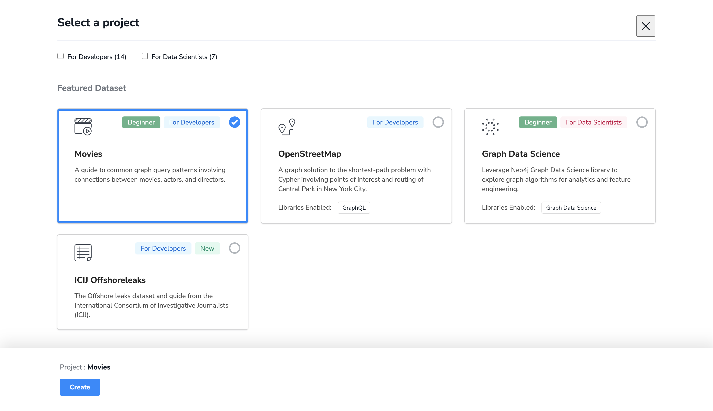
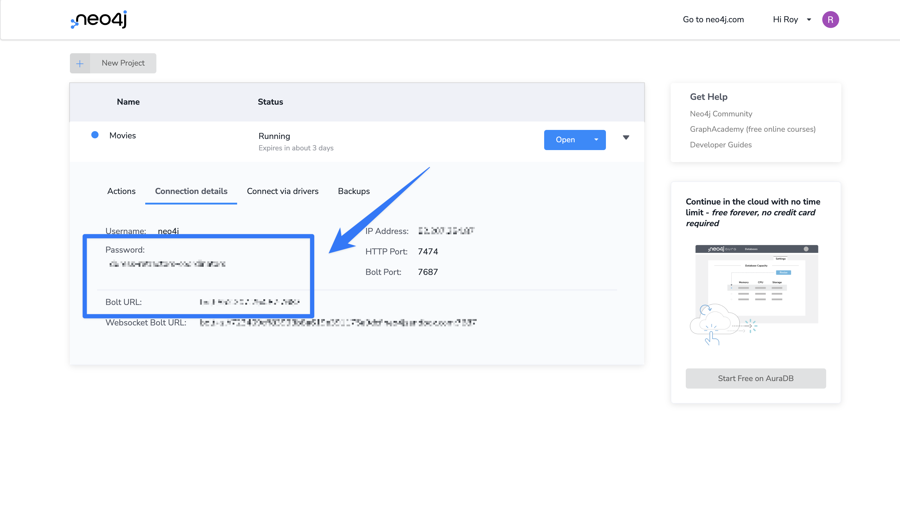
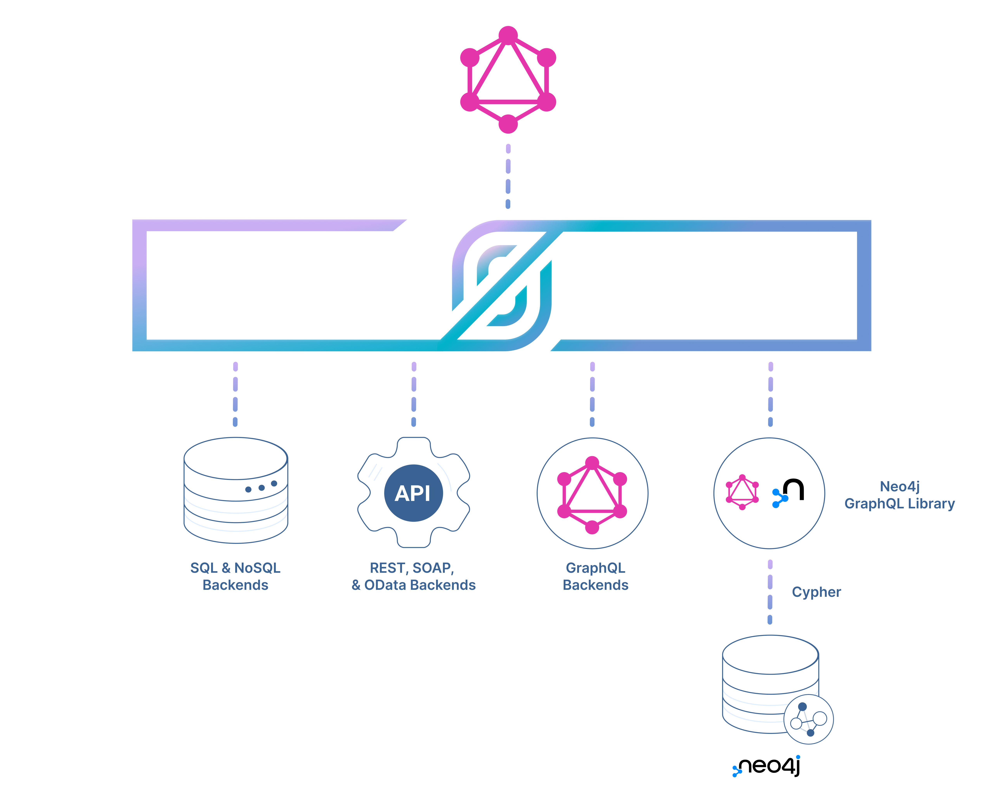

Developers all over the world are building GraphQL APIs to create powerful and flexible applications that can leverage multiple data sources. GraphQL is a query language that allows developers to define the shape and structure of the data they need. It is a powerful tool for building APIs that can efficiently deliver the data required by client applications. 

However, building a GraphQL API from scratch can be complex and time-consuming. This is where StepZen comes in. StepZen is a tool that allows developers to quickly and easily create GraphQL APIs that leverage data from multiple sources, including databases like Neo4j. 

In this blog post, we will explore how developers can use StepZen and Neo4j to build powerful GraphQL APIs that can transform how we build applications. We will look at the benefits of using StepZen and Neo4j together and explore some examples of how these tools can be used to build powerful APIs that meet the needs of a wide range of applications.

## Getting started with Neo4j and GraphQL

Developers are increasingly wanting to consume databases through the cloud given the simplicity and the low-code set up required to spin up an API to connect applications and the data they need to run. There has been a clear consumer shift towards building great applications and deferring the management of backend infrastructures to cloud services. These cloud-first products are pervading the market and Neo4j is riding the way of this industry shift.  

Having a solution that lets developers concentrate on the frontend, and takes care of backend hosting and persistence in a database, is appealing to many. Neo4j is the biggest graph database and pioneer in the industry category. Neo4j provides a GraphQL API library which is powerful because GraphQL can be mapped so neatly onto a graph database, and a graph database maps onto GraphQL nicely when they’re both implemented as graphs. 

Using a "graphs all the way down" approach is not only more intuitive for developers to reason about application data, but using a graph database backend for your GraphQL service has performance advantages as graph databases are optimized for traversing graphs - exactly the type of traversals commonly found in GraphQL queries.

### Using the Neo4j GraphQL library 

The Neo4j GraphQL library is a Node.js library, Node.js is a popular backend language so having a batteries-included library on NPM is a big plus. The Neo4j GraphQL library works with any JavaScript GraphQL implementation, such as GraphQL.js and Apollo Server or GraphQL Yoga, and is designed to make it as easy as possible to build GraphQL APIs backed by a Neo4j database. By using the Neo4j GraphQL library it becomes very easy to build an API backed by Neo4j, where you don’t need to learn a new query language to interact with your database. In fact, the two main functions of the Neo4j GraphQL library are GraphQL schema generation and "GraphQL to Cypher" translation. 

By mapping GraphQL type definitions to the property graph model used by Neo4j, the Neo4j GraphQL Library can generate a CRUD API backed by Neo4j. This means developers don’t even need to implement GraphQL resolver functions as the Neo4j GraphQL Library handles generating database queries from arbitrary GraphQL requests at query time. 

Once you, as a developer, have a GraphQL schema, which contains its type definitions, the Neo4j GraphQL library does all the heavy lifting of making the actual backbone of the API. All you need to to bring is your schema (your source of truth for types when talking to the backend) and the Neo4j GraphQL library basically handles the backend for you. Your schema is the single source of truth for both the backend and the frontend.

It becomes the documentation and the contract between them. And if you use TypeScript and build type definitions from that, the level of safety you get is really high - it will be really unlikely you can end up shipping bugs! You can find the documentation and other resources for the Neo4j GraphQL library at [neo4j.com/product/graphql-library/](https://neo4j.com/product/graphql-library/)

### Set up a Neo4j graph database

First, we will set up a GraphQL API for Neo4j using a sandbox environment to generate a GraphQL API. A sandbox is a cloud-based development environment that allows us to experiment with Neo4j and build applications without installing anything on our local machine. In this section, we will outline the steps for setting up a Neo4j sandbox that we can use to generate a GraphQL API.



1. Go to https://sandbox.neo4j.com/
2. Set up a new account. Click on the "Sign Up" button to create a new account. You will be prompted to enter your name, email address, and password. After providing this information, click on the "Create Account" button.
3. You will be taken to the sandbox dashboard after creating your account. Click on the "Movies" dataset to set up a new project from here. This dataset contains information about movies and actors, which we can use to build our GraphQL API.
4. Once you have selected the "movies" dataset, click on the "Create" button. This will create a new Neo4j graph database based on the movie dataset.

After these steps, we will have a Neo4j sandbox environment with a pre-populated movies database. We can now start building our GraphQL API using the Neo4j GraphQL Library.

### Generate a GraphQL API

After setting up the database, we can continue building the GraphQL API using the [Neo4j GraphQL Library](https://neo4j.com/docs/graphql-manual/current/). We will use the library `@neo4j/introspector` to generate the GraphQL schema based on the contents of our Neo4j graph database. This library will introspect the database and generate a GraphQL schema based on the labels and relationships in the database.

Earlier, you've learned it's based on JavaScript, meaning we would need to set up a new JavaScript (or TypeScript) project on our local machine:

1. First, create a new Node.js project:

```bash
npm init --y
```

And install the following dependencies:

```
npm install graphql @neo4j/graphql neo4j-driver @neo4j/introspector dotenv
```

These libraries are needed to connect to Neo4j, generate the GraphQL schema, and (later on) serve the GraphQL API.

> Make sure to use Node.js version 16 or higher.

2. Create a new file called `init.js` that will contain the code to generate the GraphQL API schema based on the contents of your Neo4j graph database. In this file, you need to paste the following code block:

```javascript
const { toGraphQLTypeDefs } = require("@neo4j/introspector")
const neo4j = require("neo4j-driver");
const fs = require('fs');
const path = require("path");

require('dotenv').config()

const driver = neo4j.driver(
    process.env.NEO4J_CONNECT_URL,
    neo4j.auth.basic("neo4j", process.env.NEO4J_PASSWORD)
);

const sessionFactory = () => driver.session({ defaultAccessMode: neo4j.session.READ })

async function main() {
    fs.exists(path.join(__dirname, "neo4j"), exists => {
        if (!exists) {
            fs.mkdirSync(path.join(__dirname, "neo4j"));
        }
    });

    const typeDefs = await toGraphQLTypeDefs(sessionFactory)

    fs.writeFileSync('neo4j/schema.graphql', typeDefs)
    await driver.close();
}
main()
```

3. This file needs two environment variables to connect to Neo4j, which can be found on the dashboard for your Sandbox. In the screenshot below, you can see where to find both the connect string (called Bolt URL) and password:



Which you can paste in a new file called `.env`:

```text
NEO4J_CONNECT_URL=
NEO4J_PASSWORD=
```

4. In the `package.json` file you can create a script to generate the GraphQL schema:

```json
{
  "name": "with-neo4j",
  "scripts": {
    "generate": "node init.js"
  }
}
```

5. After which, you can run the command `npm run generate` (or `yarn generate`) to have the library introspect your Neo4j graph database and generate the GraphQL schema. This schema will be saved a new file called `neo4j/schema.graphql` file.

You can now use this schema on your local machine to serve a GraphQL API. In the next section, we will use GraphQL HTTP to serve the GraphQL API. 

### Serve the Neo4j GraphQL API

We have set up a Neo4j graph database and generated a GraphQL schema based on the content of this database, the final step we need to take to access this data using GraphQL is to serve a GraphQL API. There are a lot of different libraries and tools to build and run GraphQL APIs, and for this section.

In your project, run the following command to install `@apollo/server` which we'll use the serve the Neo4j GraphQL API:

```bash
npm i @apollo/server
```

Create a new file called `server.js`, which will hold the code to serve the GraphQL schema. In this file, you can paste the following code:

```js
const { Neo4jGraphQL } = require("@neo4j/graphql");
const { ApolloServer, gql } = require("apollo-server");
const neo4j = require("neo4j-driver");
const { readFileSync } = require('fs')

require('dotenv').config()

const driver = neo4j.driver(
    process.env.NEO4J_CONNECT_URL,
    neo4j.auth.basic("neo4j", process.env.NEO4J_PASSWORD)
);

const typeDefs = readFileSync(require.resolve('./neo4j/schema.graphql')).toString('utf-8')

const neoSchema = new Neo4jGraphQL({ typeDefs, driver });

neoSchema.getSchema().then((schema) => {
    const server = new ApolloServer({
        schema,
    });

    server.listen().then(({ url }) => {
        console.log(`🚀 Server ready at ${url}`);
    });
})
```

The code in this file will connect to Neo4j, load the generated schema, and serves the GraphQL API at `localhost:4000/graphql`.

Finally, add a script to the `package.json` file to serve the GraphQL API:

```json
"scripts": {
    "generate": "node init.js",
    "start": "node server.js"
},
```

At this point, you can already try out your GraphQL API after running `npm start`. But we don't have an explorer, like GraphiQL, set up so it would only be accessible via the command line. In the next section, we'll introduce StepZen and explore the GraphQL API together.

## Using StepZen to work with GraphQL APIs

StepZen can help transform GraphQL APIs by simplifying the process of building a custom server from scratch and by offering tools and features that enable developers to create flexible, powerful APIs that leverage the capabilities of Neo4j. One of the key benefits of using StepZen with Neo4j is that it can facilitate expanding the GraphQL APIs created with the Neo4j GraphQL library.

Another way that StepZen can transform GraphQL APIs is by helping to normalize data and restrict access to certain queries. With StepZen, developers can create consistent data models across multiple data sources, allowing for easier data integration and reducing the risk of errors or inconsistencies. Additionally, StepZen's access control features allow developers to define granular permissions for different queries, restricting access to sensitive data and preventing unauthorized access.



In the above diagram, you can see how we'll use StepZen to connect to the local Neo4j GraphQL API and transform some of its data.

### Setting up StepZen

Installing and setting up StepZen is straightforward, although we need to make a small exception for this blog post. Normally, most developers use StepZen to build GraphQL APIs in the cloud, but as our Neo4j graph database is running locally, we need to use StepZen using Docker to access this local endpoint. If the endpoint was remote (e.g., deployed on a server), we could use the StepZen cloud service instead.

To install and run StepZen locally with Docker, follow these steps. Make sure you have Docker installed on your machine. We recommend using Docker Desktop for Windows or macOS or installing Docker Engine on Linux. You can find the instructions to install Docker on the [official website](https://docs.docker.com/get-docker/).

1. Install the StepZen CLI from a new terminal and run the following command to install the StepZen CLI:

```bash
npm install -g stepzen
```

2. Once installed, you can start the local StepZen service using the CLI:

```bash
stepzen service start
```

This command will start the StepZen service in a Docker container and create a local configuration file at `~/.stepzen/stepzen-config.local.yaml`.

3. Log in to the StepZen CLI pointing to the local configuration:

```bash
stepzen login --config ~/.stepzen/stepzen-config.local.yaml
```

We can now use StepZen for local development and the CLI like when running StepZen in the cloud. 

4. With the StepZen CLI installed and configured to work locally, we can import the Neo4j GraphQL API we have running. Make sure the script to serve the GraphQL API is still running, and run the following:

```
stepzen import graphql
```

The StepZen CLI will ask how you'd like to name the StepZen GraphQL endpoint (for example, `api/with-neo4j`) and what the endpoint of the GraphQL API you want to import is.

After the CLI has finished the import process, you can see a set of new files have been created. The file `graphql/index.graphql` contains the StepZen version of the GraphQL schema for your Neo4j graph database.

5. And to start the StepZen GraphQL API, you can run the following:

```
stepzen start
```

6. The CLI will now serve the GraphQL schema on a localhost endpoint, that we can explore the API for example, by using this command in the StepZen directory:


```bash
stepzen request '{ movies { title } }'
```

This command will return a list of all the movie titles in Neo4j directly in your terminal, or you could use the GraphiQL endpoint that's printed in your terminal after starting the StepZen GraphQL API.

### Extending data using StepZen

With GraphQL, developers can easily define the shape and structure of the data they need. When using StepZen, you can integrate data from multiple sources and extend the data in your GraphQL API. To illustrate this process, we will use the example of adding data from the New York Times Movie Reviews API to a Neo4j graph database. 

The New York Times Movie Reviews API provides access to movie reviews from the New York Times. We can use this API to add additional data to our graph database. For example, we can render the movie review next to the data from our graph database.

Let's start by adding the New York Times Movie Reviews API to our StepZen GraphQL API:

1. We need to sign up for a New York Times API key by following the instructions on the [developer page](https://developer.nytimes.com/get-started). After creating an account, we can [create an application](https://developer.nytimes.com/my-apps) and find the API key for the free New York Times API here.

2. Next, we'll use the [endpoint for movie reviews](https://developer.nytimes.com/docs/movie-reviews-api/1/routes/reviews/search.json/get) to search for movies. We'll search for the movie "The Matrix" and add the opening date to filter out any duplicates (like sequels). We can use the following cURL command:

```bash
curl "https://api.nytimes.com/svc/movies/v2/reviews/search.json?query=matrix&opening-date=1999-01-01:1999-31-12&api-key=YOUR_API_KEY"
```

> The value for `opening_date` is structured as a range, so to search for the entire year 1999, we search between January 1st, 1999, and December 31st, 1999.

3. After getting the search results, we can add the REST endpoint to a new GraphQL schema file as a query. In the directory `stepzen`, we create a new file called `nyt/index.graphql` and add the following:

```graphql
type MovieReview {
    byline: String
    headline: String
}

type MoviewReviewLink {
    url: String
}

type Query {
  movieReviews(keyword: String!, released: BigInt!): [MovieReview]
      @rest(  
        endpoint: """
             https://api.nytimes.com/svc/movies/v2/reviews/search.json?query={{.Get "keyword"}}&opening-date={{.Get "released"}}-01-01:{{.Get "released"}}-31-12
        """
        resultroot: "results[]"
        configuration: "nyt"
      )
}
```

> Often, the StepZen CLI can automatically generate a GraphQL schema based on a cURL command. See [this section](https://stepzen.com/docs/quick-start/with-rest-import) in the StepZen documentation for more information. 

4. We can then add it to the main `index.graphql` file:

```graphql
schema @sdl(files: ["graphql/index.graphql", "nyt/index.graphql"]) {
  query: Query
}
```

5. One piece of information is still missing, the value for `apiKey`. We don't pass it as a query argument but through configuration. We create a file called `config.yaml` and add the following:

```yaml
configurationset:
  - configuration:
      name: nyt
      apiKey: YOUR_API_KEY
```

6. After saving, StepZen will serve the updated GraphQL schema containing a new field called `movieReviews` that you can use to retrieve all the NYT reviews containing a keyword and opening date. We can now try running the following request:

```bash
stepzen request '{ movieReviews(keyword: "matrix", released: "1999") { headline byline } }'
```

And there's much more you can do with StepZen. For example, you can use the `@materializer` custom directive to add data from NYT to your Neo4j graph database responses automatically. If you've been building with Neo4j before, you might know the [`@cypher` custom directive](https://neo4j.com/docs/graphql-manual/current/type-definitions/cypher/). The `@materializer` custom directive works similarly, but instead of executing a Cypher query, it executes a GraphQL query.

Using this `@materializer` custom directive can be done in the file `nyt/index.graphql`. In this file, we'll extend the already existing type `Movie` (from our Neo4j graph database) with an additional field that contains the reviews:

```graphql
extend type Movie {
    reviews: [MovieReview]
        @materializer(
            query: "movieReviews", 
            arguments: [
                {name: "keyword", field: "title"}
                {name: "released", field: "released"}
            ]
        )
}
```

With this addition, whenever you request the field `reviews` from `Movie` a request to the query `movieReviews` will be sent. The fields `title` and `released` from `Movie` will be passed along and used to get the reviews from NYT.

Try this out by running the following request:

```graphql
{
  movies(options: {limit: 3}) {
    title
    reviews {
        headline
      }
  }
}
```

> Don't forget to set the value for `limit` to 3, as the NYT REST API only allows a set number of requests per time.

In the same way, as we've just linked the NYT REST API to the GraphQL API using StepZen, we can connect any other data source. You can link data from anywhere to your data from Neo4j.

## Where to go from here?

In this blog post, you've learned how to set up a GraphQL API for a Neo4j graph database and extend its data using StepZen. Also, you've learned how to limit the fields available in GraphQL. 

When you're building a GraphQL API, you might want to limit the fields that are available to the client. The GraphQL schema that's generated by Neo4j contains all the fields that are available in the database. This can be a problem if you want to limit the fields that are available to the client. For example, let's say you have a Neo4j graph database that contains a lot of data about your users. You might want to limit the fields that are available to the client to only the fields that are needed for the application. 

Another benefit of combining StepZen and Neo4j is that it can simplify the process of building a GraphQL API. Using StepZen's tools and features to create the API, developers can avoid the complexity of building a custom GraphQL server from scratch. Instead, they can focus on defining the data schema and queries needed for their application and let StepZen handle the rest.

What integrations between Neo4j and StepZen would you like to see?

